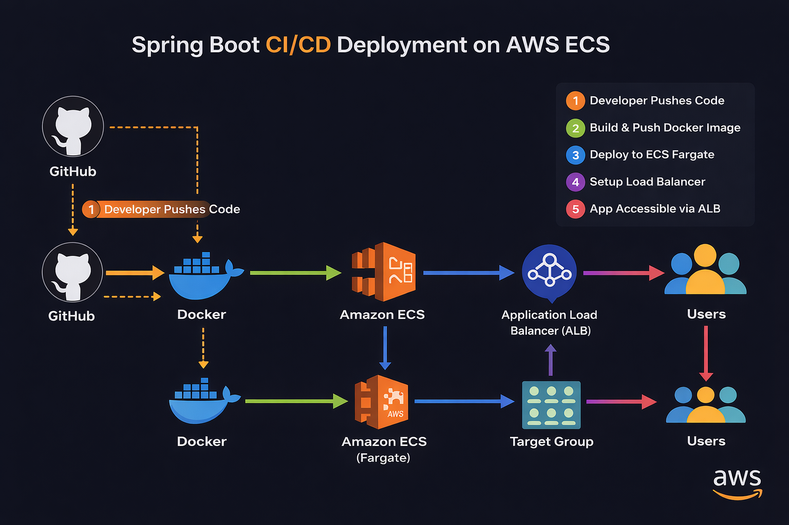
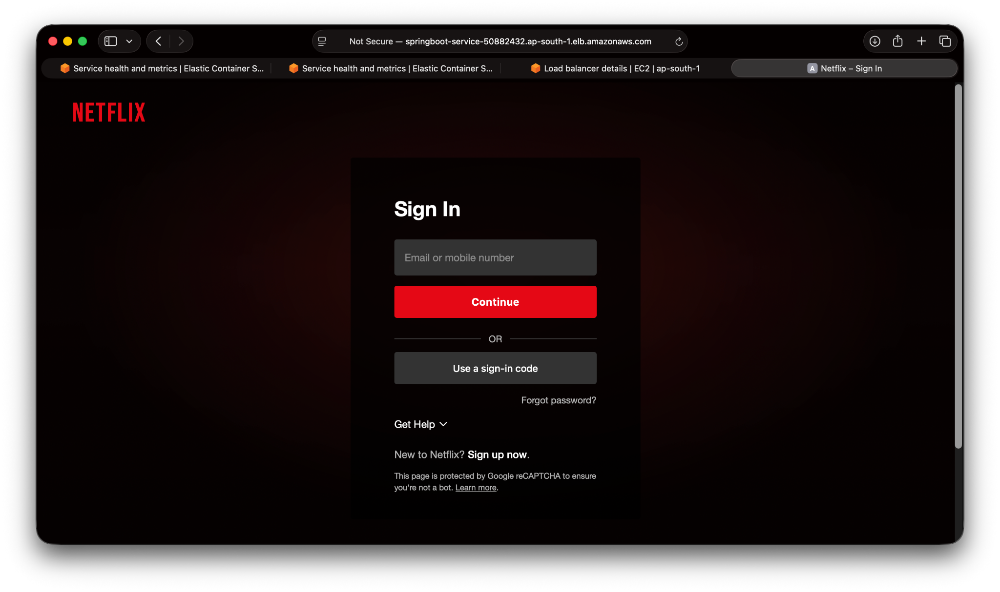
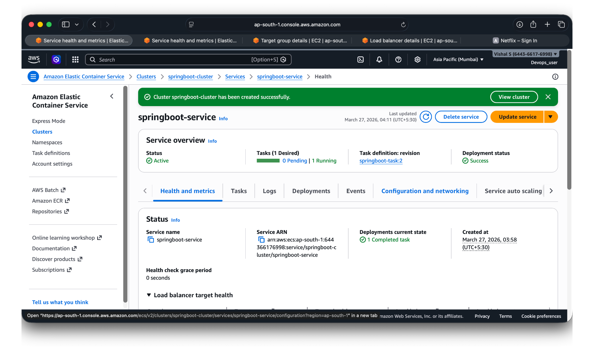
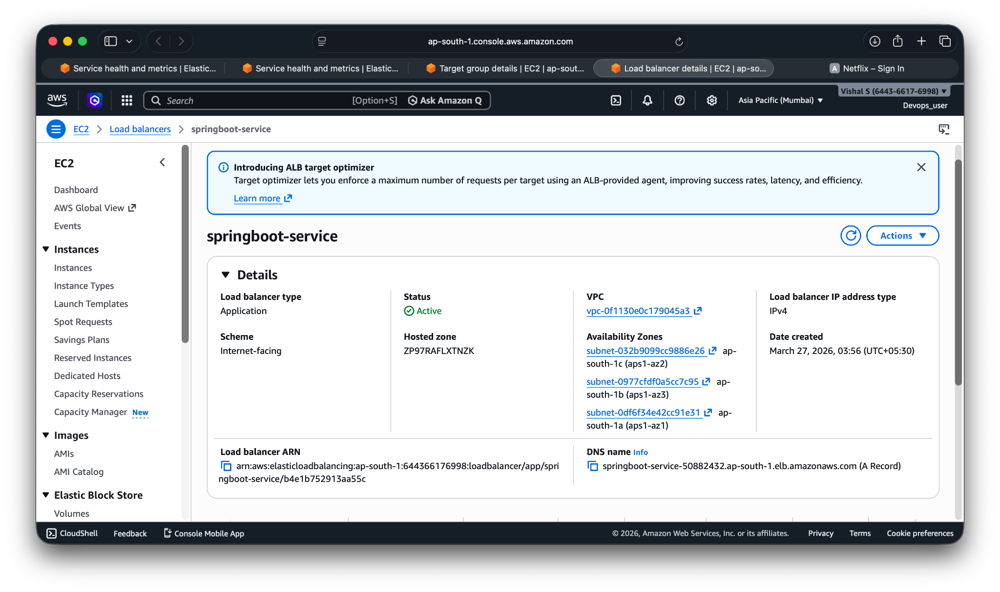
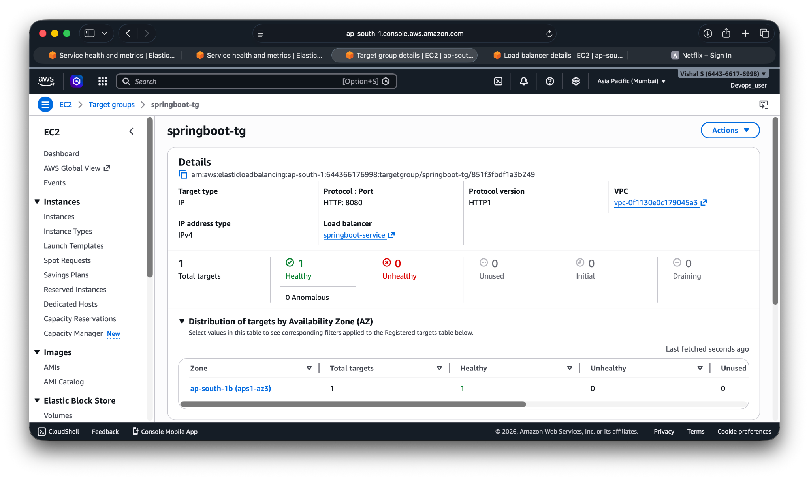

#  Spring Boot CI/CD Deployment on AWS ECS

This project demonstrates deploying a **Spring Boot application** using **Docker** and **AWS ECS (Fargate)** with an **Application Load Balancer** for public access.

---

##  Architecture Overview



---

##  Tech Stack

* **Java (Spring Boot)**
* **Docker**
* **Docker Hub**
* **AWS ECS (Fargate)**
* **Application Load Balancer (ALB)**
* **GitHub**

---

##  Deployment Flow

1. Developer pushes code to GitHub
2. Application is containerized using Docker
3. Docker image is pushed to Docker Hub
4. AWS ECS pulls the image from Docker Hub
5. ECS runs the container using Fargate
6. Application is exposed via Application Load Balancer

---

##  Project Screenshots

###  Application Running



---

###  ECS Service Running



---

###  Load Balancer



---

###  Target Group Health



---

##  How to Run Locally

```bash
# Clone repo
git clone https://github.com/Vishal5205/springboot-ecs-cicd.git

# Navigate to project
cd springboot-ecs-cicd

# Build Docker image
docker build -t springboot-app .

# Run container
docker run -p 8080:8080 springboot-app
```

---

##  AWS Deployment Steps

1. Create ECS Cluster (Fargate)
2. Create Task Definition
3. Configure Container (Docker Hub image)
4. Create Service
5. Attach Load Balancer
6. Access application via ALB DNS

---

##  Key Highlights

1. End-to-end containerized deployment
2. Fully managed serverless containers using ECS Fargate
3. Public access via Load Balancer


##  Author

**Vishal S**
🔗 GitHub: https://github.com/Vishal5205
📧 Email: [svishal1326@gmail.com](mailto:svishal1326@gmail.com)

---

